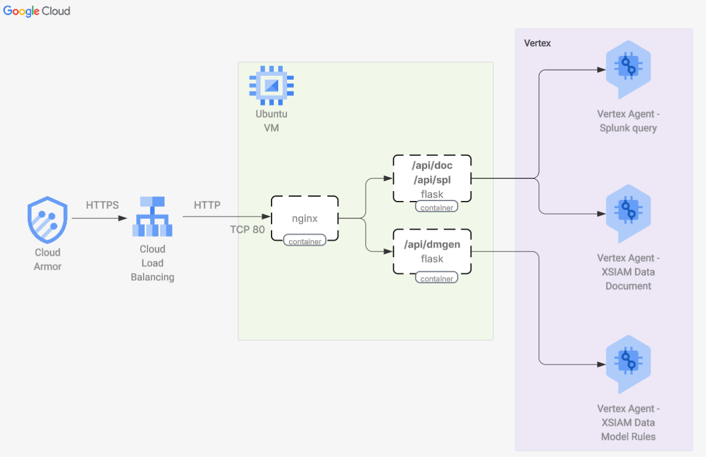

# XSIAM AI Tools on Google Vertex

## Application deployment

## AI Agents

This repository provides three AI-powered agents designed to streamline workflows for XSIAM on Google Vertex:

1. **SPL to XQL Converter**  
    Accepts a SPL (Search Processing Language) query and automatically translates it into an equivalent XQL (XSIAM Query Language) statement, enabling seamless migration and interoperability between platforms.

2. **Data Source Documentation Generator**  
    Given a data source name, this agent generates a comprehensive change or implementation document. It outlines integration steps, configuration details, and best practices for onboarding new data sources into XSIAM.

3. **Raw Log to Data Model Rule Generator**  
    Processes raw log samples and produces XSIAM data model rules. This helps automate the creation of parsing and normalization rules, accelerating the mapping of logs to XSIAM’s standardized data models.

Each agent is designed to reduce manual effort and improve accuracy in security operations workflows.
